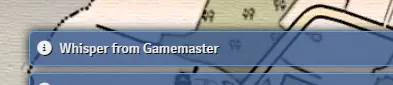
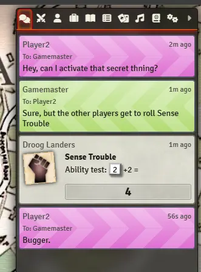
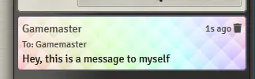

# Louder Whispers

A module for Foundry VTT which will help you pay a-goddamn-ttention to your incoming whispers (private messages), including audio overrides, notifications, and eye-popping chat box styling.

## Installation

From the Foundry VTT setup screen, go to "Add-on Modules", and search for **"louder whispers"**.

## Usage

None of the options are turned on by default. Go to "Configure Settings" => "Module Settings and turn on the options you want.

## Options

### "Show notifications when you get whispers?"

**No**: You won't get any extra notifications.

**Yes (temporary)**: You'll get a notification when someone whispers you, but the notification will disappear after a few seconds.

**Yes (permanent until dismissed)**: You'll get a notification when someone whispers you, and the notification will remain until you click it away.

Example:

### "Override audio for whispers?"

Foundry's default audio for incoming whispers is a quiet "splut" sound, easily missed if you have lots of chatter going on. Use this option to pick one of three louder options.

* **None**: use the default Foundry audio.
* **Airhorn**: HOOOONK! You'll definitely notice that whisper.
* **Bike horn**: A more subtle honk.
* **Electronic chime**: A gentle "ding" sound, still louder than the default.

### "Make whispers stand out in the chat log?"

When enabled, whispers will get special styling in the chat log:

Messages TO you get diagonal stripes pointing left ("towards" you) and messages FROM you get diagonal stripes pointing right ("away" from you.) Whispers are also coloured to match the sender.

Messages to yourself get a fabulous rainbow background.

### "Custom audio path"

If you don't like any of the provided sound effects, you can upload a `.wav` or `.mp3` (or any other browser-compatible audio format)  to your Foundry server's `Data` folder and use that instead.

Enter the path to your audio file in the field - it should be relative to your Foundry server's `Data` folder.

## Attribution

Air horn from https://soundbible.com/1542-Air-Horn.html

Electronic chime from https://soundbible.com/1599-Store-Door-Chime.html

Bike horn from https://soundbible.com/1446-Bike-Horn.html
